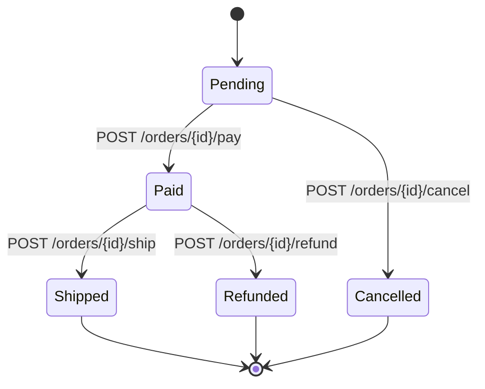

# Pattern 01: Richardson Maturity Model & HATEOAS

## 1. Executive Summary & Specification Overview

The **Richardson Maturity Model (RMM)**, formulated by Leonard Richardson, establishes a 4-tier grading scale (Levels 0 through 3) for measuring how effectively a network service leverages the architectural constraints of the World Wide Web and HTTP protocol.

```
Level 3: Hypermedia Controls (HATEOAS — HAL / JSON:API)
   ▲
Level 2: HTTP Verbs & Status Codes (GET, POST, PUT, DELETE, 200, 201, 404, 409)
   ▲
Level 1: Distinct Resources (URIs: /orders/1, /users/42)
   ▲
Level 0: The Swamp of POX (Single endpoint, RPC over HTTP POST)
```

**HATEOAS (Hypermedia As The Engine Of Application State)** represents Level 3 maturity: a client navigates the REST API dynamically through hypermedia links (`_links`) provided in resource representations, rather than hardcoding URI templates or state transitions out-of-band.

---

## 2. Richardson Maturity Model Breakdown

### Level 0 — The Swamp of Plain Old XML/JSON (POX)
- A single URI endpoint is used for all operations (e.g., `POST /api` or `POST /service.asmx`).
- HTTP is treated merely as a transport tunnel (RPC style, SOAP, XML-RPC).
- HTTP status codes are ignored; responses always return `200 OK` with an application-level error wrapper: `{"status": "error", "code": 500}`.
- **Flaws:** Bypasses HTTP caching proxies, CDNs, HTTP security headers, and standard web infrastructure.

### Level 1 — Resource-Oriented URIs
- Distinct URIs represent individual domain entities: `/orders`, `/orders/123`, `/customers/45`.
- Still typically uses a single HTTP method (`POST`) or does not leverage verbs correctly.
- **Gain:** Establishes nouns and resource boundaries.

### Level 2 — Standard HTTP Verbs & Status Codes
- Leverages the semantics of standard HTTP methods:
  - `GET`: Safe, idempotent resource retrieval.
  - `POST`: Non-idempotent resource creation or command execution.
  - `PUT`: Idempotent full resource replacement.
  - `PATCH`: Partial resource update.
  - `DELETE`: Idempotent resource deletion.
- Uses standard HTTP status codes (`200 OK`, `201 Created`, `204 No Content`, `400 Bad Request`, `404 Not Found`, `409 Conflict`, `422 Unprocessable Entity`, `500 Internal Error`).
- **Status Quo:** The vast majority of production enterprise REST APIs operate at Level 2.

### Level 3 — Hypermedia Controls (HATEOAS)
- The representation includes hypermedia links describing available state transitions based on the current state of the resource.
- Standard formats: **HAL (Hypertext Application Language)**, **JSON:API**, **Siren**, **Collection+JSON**.

```json
{
  "id": "ord_100",
  "status": "pending",
  "amount": 149.99,
  "currency": "USD",
  "_links": {
    "self": { "href": "/orders/ord_100", "method": "GET" },
    "pay": { "href": "/orders/ord_100/pay", "method": "POST", "title": "Pay for this order" },
    "cancel": { "href": "/orders/ord_100/cancel", "method": "POST", "title": "Cancel order" },
    "update": { "href": "/orders/ord_100", "method": "PATCH", "title": "Modify items" }
  }
}
```

---

## 3. Dynamic State Machine Modeling with HATEOAS

In an order processing domain, available actions depend on the lifecycle state of the order:



### Go Implementation: State-Driven Hypermedia Engine

```go
func OrderStateLinks(baseURL string, order Order) Links {
	orderURI := fmt.Sprintf("%s/orders/%s", baseURL, order.ID)
	links := Links{
		"self": Link{Href: orderURI, Method: http.MethodGet, Title: "Get order details"},
	}

	switch order.Status {
	case "pending":
		links["pay"] = Link{
			Href:   fmt.Sprintf("%s/orders/%s/pay", baseURL, order.ID),
			Method: http.MethodPost,
			Title:  "Pay for this order",
		}
		links["cancel"] = Link{
			Href:   fmt.Sprintf("%s/orders/%s/cancel", baseURL, order.ID),
			Method: http.MethodPost,
			Title:  "Cancel pending order",
		}
	case "paid":
		links["ship"] = Link{
			Href:   fmt.Sprintf("%s/orders/%s/ship", baseURL, order.ID),
			Method: http.MethodPost,
			Title:  "Mark order as shipped",
		}
		links["refund"] = Link{
			Href:   fmt.Sprintf("%s/orders/%s/refund", baseURL, order.ID),
			Method: http.MethodPost,
			Title:  "Request order refund",
		}
	case "shipped":
		links["track"] = Link{
			Href:   fmt.Sprintf("%s/orders/%s/tracking", baseURL, order.ID),
			Method: http.MethodGet,
			Title:  "Track order delivery",
		}
	case "cancelled", "refunded":
		// Terminal states: only self link remains
	}

	return links
}
```

---

## 4. Production Trade-Offs & Principal Engineer Guidance

| Aspect | Level 2 (Standard REST + OpenAPI) | Level 3 (HATEOAS) |
|---|---|---|
| **Client Decoupling** | Moderate (Clients rely on OpenAPI contract) | High (Clients follow server-provided state links) |
| **Payload Overhead** | Low (Minimal JSON) | Higher (Includes `_links` metadata) |
| **Tooling & SDK Support** | Extremely high (OpenAPI, Swagger Codegen, Postman) | Low (Custom client logic required to traverse links) |
| **Best Fit For** | High-throughput CRUD APIs, public microservices | Complex state machines (Fintech, KYC flows, multi-step checkouts) |

**Recommendation:** Adopt Level 2 everywhere with rigorous OpenAPI 3.1 contracts. Introduce HATEOAS selectively on workflow-heavy domains (e.g. payment state machines, subscription lifecycle, KYC verification flows).
