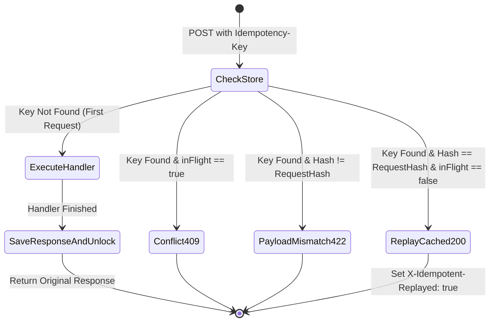

# Pattern 06: The Idempotency Pattern

## 1. Executive Summary & Problem Statement

In distributed systems, network partitions and client timeouts are inevitable. When a client sends a `POST /orders` (or `POST /payments`) request and experiences a network drop or timeout before receiving the response, the client cannot know whether:
1. The server received and completed the transaction before the network failed, or
2. The request was dropped on the wire before reaching the server.

If the client naively retries a non-idempotent `POST` request, it risks charging the customer twice or creating duplicate orders.

**The Idempotency Pattern (IETF Draft `draft-ietf-httpapi-idempotency-key-header`)** ensures that performing the same operation multiple times with the same `Idempotency-Key` produces the exact same result as the initial execution.

---

## 2. Idempotency State Machine & Key Lifecycle



---

## 3. Four Core Edge Cases Handled by Production Idempotency

| Scenario | Inbound State | Action | HTTP Response |
|---|---|---|---|
| **1. First Request** | Key not present in store. | Insert record with `inFlight: true`, execute business logic, persist status code + response body + headers, mark `inFlight: false`. | `201 Created` / `200 OK` (Original Response) |
| **2. Safe Retry (Replay)** | Key exists, `inFlight: false`, request body SHA-256 hash matches previous record. | Replay the cached response code, headers, and body verbatim without executing downstream business logic. | Identical to original + `X-Idempotent-Replayed: true` |
| **3. Concurrent In-Flight Retry** | Key exists, `inFlight: true` (a concurrent request with the same key is currently running). | Reject the concurrent retry to prevent race conditions. | `409 Conflict` ("Request currently being processed") |
| **4. Key Reuse / Payload Mismatch** | Key exists, but the request payload body differs from the first request's SHA-256 hash. | Reject the request to prevent accidental key collision / misuse. | `422 Unprocessable Entity` ("Key reused with different body") |

---

## 4. Production Go Implementation Walkthrough

```go
func (s *IdempotencyStore) Middleware(next http.Handler) http.Handler {
	return http.HandlerFunc(func(w http.ResponseWriter, r *http.Request) {
		if r.Method != http.MethodPost && r.Method != http.MethodPatch {
			next.ServeHTTP(w, r)
			return
		}

		key := r.Header.Get("Idempotency-Key")
		if key == "" {
			BadRequest(w, r, "The 'Idempotency-Key' header is required for this endpoint.")
			return
		}

		bodyBytes, _ := io.ReadAll(r.Body)
		r.Body = io.NopCloser(bytes.NewReader(bodyBytes))
		hash := sha256.Sum256(bodyBytes)
		reqHash := hex.EncodeToString(hash[:])

		s.mu.Lock()
		rec, exists := s.records[key]
		if exists {
			if rec.inFlight {
				s.mu.Unlock()
				Conflict(w, r, "A request with the same Idempotency-Key is still being processed.")
				return
			}
			if rec.requestHash != reqHash {
				s.mu.Unlock()
				UnprocessableEntity(w, r, "This Idempotency-Key was previously used with a different request body.")
				return
			}

			// Replay cached response
			for k, vv := range rec.headers {
				for _, v := range vv {
					w.Header().Add(k, v)
				}
			}
			w.Header().Set("X-Idempotent-Replayed", "true")
			w.WriteHeader(rec.statusCode)
			_, _ = w.Write(rec.body)
			s.mu.Unlock()
			return
		}

		// Mark in-flight
		rec = &idempotencyRecord{requestHash: reqHash, createdAt: time.Now(), inFlight: true}
		s.records[key] = rec
		s.mu.Unlock()

		rw := &responseRecorder{ResponseWriter: w, statusCode: http.StatusOK, body: &bytes.Buffer{}}
		next.ServeHTTP(rw, r)

		s.mu.Lock()
		rec.inFlight = false
		rec.statusCode = rw.statusCode
		rec.body = rw.body.Bytes()
		rec.headers = rw.Header().Clone()
		s.mu.Unlock()
	})
}
```

---

## 5. Distributed Production Deployment (Redis Architecture)

In multi-instance production environments, in-memory Go maps must be replaced with **Redis** using atomic distributed commands:

1. **Lock Acquisition:** `SET idempotency:<key> <hash> NX EX 120` (Returns `OK` for first caller, `nil` for concurrent in-flight requests).
2. **Response Persistence:** `SET response:<key> <serialized_response> EX 172800` (48-hour retention TTL).
3. **Payload Hashing:** Store `sha256(request_body)` to validate that retries are identical.
