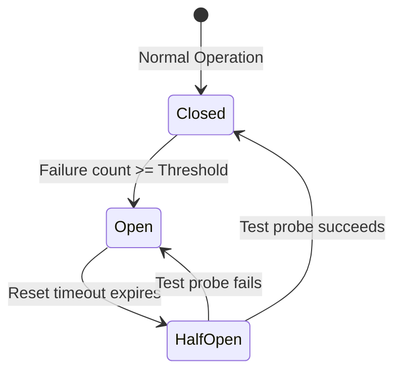

# Pattern 08: Resilience, Retries & The Circuit Breaker Pattern

## 1. Executive Summary & Problem Overview

In a distributed microservice architecture, transient failures (network jitter, brief server reboots, temporary load spikes) are normal occurrences. However, blind retries can lead to the **Thundering Herd Problem** and **Retry Storms**, taking down upstream and downstream services completely.

Production resilience combines two complementary patterns:
1. **Exponential Backoff with Full Jitter:** Retries transient failures with randomized exponential delay to prevent synchronized retry waves.
2. **The Circuit Breaker Pattern:** Prevents an application from repeatedly trying an operation that is almost certainly doomed to fail, giving downstream services time to recover.

---

## 2. Exponential Backoff with Full Jitter

When multiple clients experience a transient failure at the same moment, retrying at identical fixed intervals produces synchronized spikes of traffic. **Full Jitter** breaks up this synchronization:

$$T_{\text{sleep}} = \text{random}(0, \text{baseDelay} \times 2^{\text{attempt}})$$

```go
func RetryWithBackoff(ctx context.Context, maxAttempts int, baseDelay time.Duration, fn func() error) error {
	var lastErr error
	for attempt := range maxAttempts {
		if err := ctx.Err(); err != nil {
			return err
		}

		lastErr = fn()
		if lastErr == nil {
			return nil
		}

		// Fail fast if error is non-retryable (e.g. 400 Bad Request / validation)
		if !errors.Is(lastErr, ErrRetryable) {
			return lastErr
		}

		backoff := float64(baseDelay) * math.Pow(2, float64(attempt))
		jittered := time.Duration(rand.Float64() * backoff)

		select {
		case <-time.After(jittered):
		case <-ctx.Done():
			return ctx.Err()
		}
	}
	return lastErr
}
```

### Critical Rule: Error Classification (`ErrRetryable`)
Never retry non-retryable errors (e.g., `400 Bad Request`, `401 Unauthorized`, `422 Unprocessable Entity`, `404 Not Found`). Only retry transient errors (network timeouts, DNS blips, downstream `502 Bad Gateway`, `503 Service Unavailable`, `504 Gateway Timeout`).

---

## 3. The Circuit Breaker State Machine



### State Definitions
1. **Closed (Normal):** Requests pass through directly to downstream dependencies. Failures increment a counter. If the failure threshold is reached, the breaker trips to **Open**.
2. **Open (Tripped):** Requests are failed immediately without making any downstream network calls (`ErrCircuitOpen` -> `503 Service Unavailable`). This eliminates unnecessary load on a struggling dependency.
3. **Half-Open (Testing Recovery):** After a cooldown period (`resetTimeout`), a single exploratory test request is allowed through. If it succeeds, the breaker resets to **Closed**; if it fails, it trips back to **Open**.

---

## 4. Circuit Breaker Implementation in Go

```go
type CircuitBreaker struct {
	mu               sync.Mutex
	state            CircuitState
	failureCount     int
	failureThreshold int
	openedAt         time.Time
	resetTimeout     time.Duration
}

func (cb *CircuitBreaker) Execute(fn func() error) error {
	cb.mu.Lock()
	if cb.state == StateOpen {
		if time.Since(cb.openedAt) > cb.resetTimeout {
			cb.state = StateHalfOpen
		} else {
			cb.mu.Unlock()
			return ErrCircuitOpen
		}
	}
	cb.mu.Unlock()

	err := fn()

	cb.mu.Lock()
	defer cb.mu.Unlock()
	if err != nil {
		cb.failureCount++
		if cb.state == StateHalfOpen || cb.failureCount >= cb.failureThreshold {
			cb.state = StateOpen
			cb.openedAt = time.Now()
		}
		return err
	}

	cb.state = StateClosed
	cb.failureCount = 0
	return nil
}
```

---

## 5. HTTP Handler Integration: Returning 503

When the circuit breaker is open, the API handler maps `ErrCircuitOpen` directly to **`503 Service Unavailable`** with a `Retry-After` header:

```go
err := h.breaker.Execute(func() error {
    return callPaymentService(ctx, amount, currency)
})
if err != nil {
    if errors.Is(err, ErrCircuitOpen) {
        ServiceUnavailable(w, r, "The payment gateway is temporarily offline. Please retry in 30 seconds.", 30)
        return
    }
    InternalError(w, r)
    return
}
```
