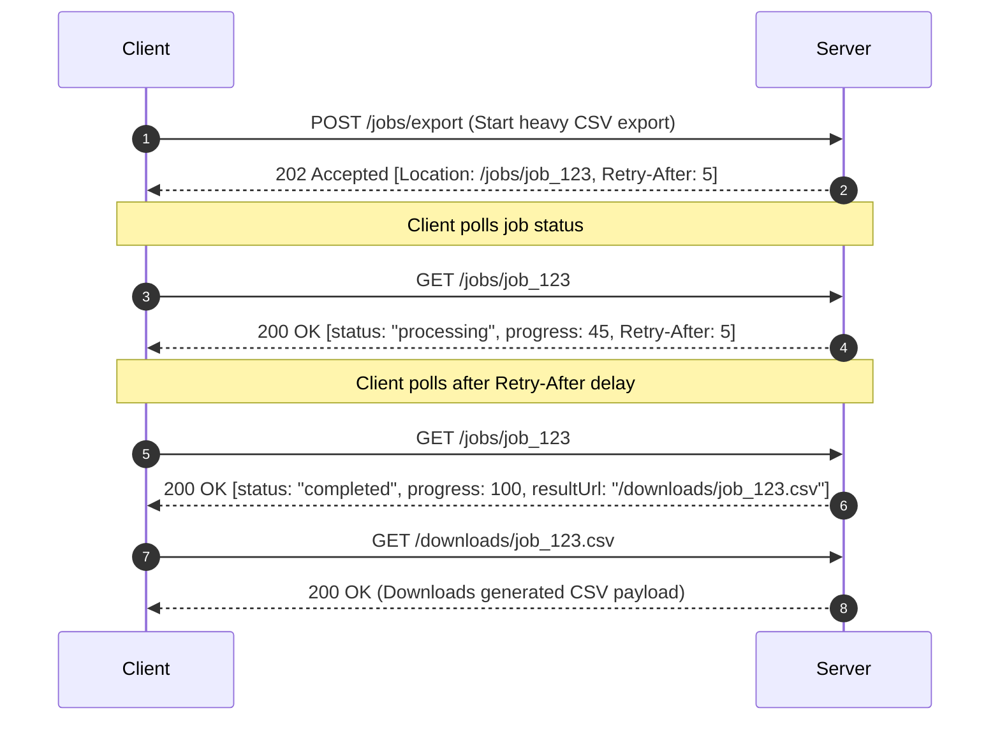

# Pattern 10: Asynchronous Long-Running Operations (Job Pattern)

## 1. Executive Summary & Problem Overview

HTTP is fundamentally a synchronous request-response protocol. However, operations such as large CSV exports, PDF invoice generation, video processing, bulk batch updates, or heavy data syncs can take tens of seconds or minutes to complete.

Holding an HTTP connection open for long periods introduces severe risks:
- Gateway and load balancer timeouts (e.g. AWS ALB 60s timeout, Cloudflare 100s timeout).
- Thread and socket pool exhaustion on the application server.
- Poor user experience and inability for clients to monitor progress.

**The Asynchronous Job Pattern (RFC 7240 / RFC 9110 Section 15.3.3)** solves this by returning **`202 Accepted`** immediately with a `Location` header pointing to a job tracking resource.

---

## 2. Asynchronous Job Lifecycle



---

## 3. HTTP Protocol Semantics for Asynchronous Operations

### 1. Job Creation Response (`202 Accepted`)
```http
HTTP/1.1 202 Accepted
Location: /jobs/job_9a8b7c
Retry-After: 5
Content-Type: application/json

{
  "job": {
    "id": "job_9a8b7c",
    "type": "orders_export_csv",
    "status": "pending",
    "progress": 0,
    "createdAt": "2026-08-29T14:00:00Z"
  },
  "message": "Asynchronous job accepted for processing.",
  "_links": {
    "status": { "href": "/jobs/job_9a8b7c", "method": "GET" },
    "cancel": { "href": "/jobs/job_9a8b7c", "method": "DELETE" }
  }
}
```

### 2. Polling Endpoint (`GET /jobs/{id}`)
- While `pending` or `processing`: Returns `200 OK` (or `202 Accepted`) with current `progress` integer ($0-100\%$) and `Retry-After` header specifying seconds until next poll.
- When `completed`: Returns `200 OK` with `resultUrl`.
- When `failed`: Returns `200 OK` with error description.

### 3. Job Cancellation (`DELETE /jobs/{id}`)
- If job is in-flight: Marks job status as `cancelled` and returns `204 No Content`.
- If job is already finished: Returns `409 Conflict`.

---

## 4. Background Worker Pool in Go

```go
func RunBackgroundWorkerPool(ctx context.Context, numWorkers int, tasks <-chan func()) {
	var wg sync.WaitGroup
	for range numWorkers {
		wg.Add(1)
		go func() {
			defer wg.Done()
			for {
				select {
				case <-ctx.Done():
					return
				case task, ok := <-tasks:
					if !ok {
						return
					}
					task()
				}
			}
		}()
	}
	<-ctx.Done()
	wg.Wait()
}
```
